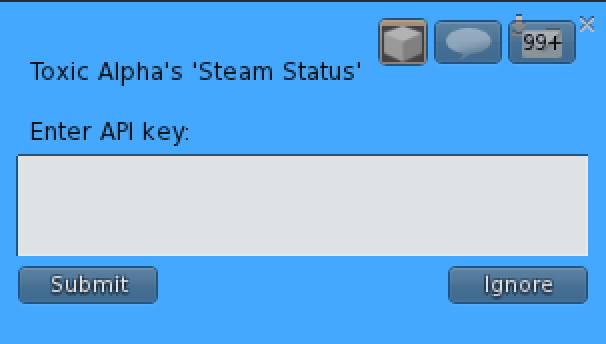
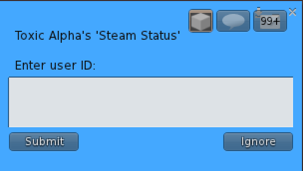

# Steam Status

Welcome to the Setup Instructions for the Steam Status accessory. You can obtain the [Steam Status accessory via the Second Life Marketplace](https://marketplace.secondlife.com/en-US/stores/261651). There is also a color picker tool below which you can use to get the hex code you will need for changing the Steam Status text color:

<input type="color" onchange="document.getElementById('color').innerText = 'Hex code: ' + this.value;">  

## Setup Instructions

You will need both a **Steam API Key** and your **Steam User ID**, each which can be obtained with the following steps. Once obtained, click the Steam Status accessory in Second Life to input your Steam API Key and your Steam User ID. You will also need to set your Steam Friends status to **Online**.

### 1. Get Your Steam API Key

1. **Log into Steam**: Open your web browser and go to the [Steam website](https://store.steampowered.com/). Log in with your Steam account.
   
2. **Go to the Steam API Key Page**: Navigate to the [Steam Web API Key registration page](https://steamcommunity.com/dev/apikey). You may be prompted to install Steam Guard Mobile Authenticator. If so, follow the installation instructions and then return to the [Steam Web API Key registration page](https://steamcommunity.com/dev/apikey).

3. **Generate Your API Key**:
   - If you don't already have an API key, you'll see a form asking for a domain name. You can enter any domain name (even a placeholder like "localhost").
   - Agree to the terms, and click on **"Register"**.
   - Your API key will be generated and displayed on the page.
   - Click on the Steam Status accessory in Second Life and choose **Enter API Key**. You can then copy the API key and paste it into the box:   

### 2. Find Your Steam User ID

Your Steam user ID is a unique identifier for your account. You can find it in several ways:

- **From Your Profile URL**:
  1. Go to your Steam profile by clicking on your username in the upper right corner and selecting **"Profile"**.
  2. Look at the URL in your browser's address bar. It will look something like this: `https://steamcommunity.com/id/YourCustomID/` or `https://steamcommunity.com/profiles/12345678901234567/`.
  3. If your URL is in the format `/profiles/12345678901234567/`, then `12345678901234567` is your Steam user ID.
  4. If your URL is in the format `/id/YourCustomID/`, you'll need to look it up by using third-party services like [SteamID.io](https://steamid.io/) or converting it by logging into Steam and checking under your account details.
  5. - Click on the Steam Status accessory in Second Life and choose **Enter user ID**. You can then copy the ID and paste it into the box:   

### 3. Make Sure Your Steam Friends status is set to Online

To make sure your Steam Friends status is set to **Online**, follow these steps:

   - Open the Steam client.
   - Select the Friends tab from menu at the top of the screen.
   - A drop-down menu will open showing all the different status options you can choose from.
   - Select **Online** from the drop-down menu.
